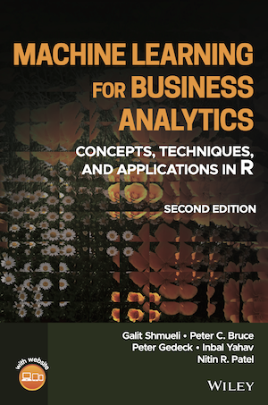
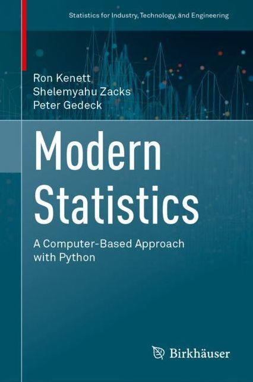
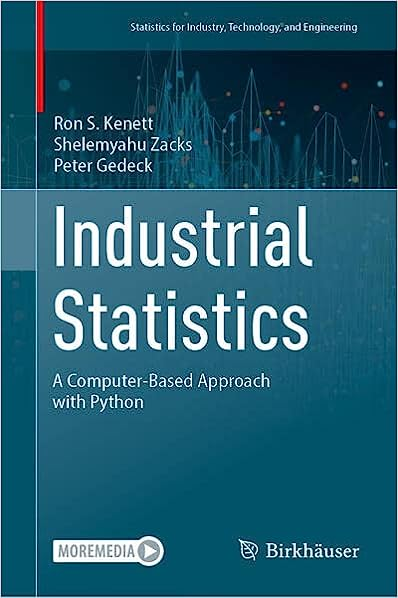

# Books
<table>
 <tr>
  <td></td>
  <td>
   
<b>Practical Statistics for Data Scientists:</b>

   
50+ Essential Concepts Using R and Python 
by Peter Bruce, Andrew Bruce, and <a href="https://www.amazon.com/Peter-Gedeck/e/B082BJZJKX/">Peter Gedeck</a>

   <ul>
    <li>Publisher: <a href="https://oreil.ly/practicalStats_dataSci_2e">O'Reilly Media</a>; 2nd edition (June 9, 2020)</li>
   <li>ISBN-13: 978-1492072942</li>
    <li>Buy on <a href="https://www.amazon.com/Practical-Statistics-Data-Scientists-Essential/dp/149207294X">Amazon</a></li>
   <li>Errata: <a href="http://oreilly.com/catalog/errata.csp?isbn=9781492072942">http://oreilly.com/catalog/errata.csp?isbn=9781492072942</a></li>
   </ul>

Code for Practial Statistics for Data Scientists is <a href="practical-statistics-for-data-scientists/">here</a>.

</td>
  </tr>

<tr>
<td></td>
<td>
<h2>Machine Learning for Business Analytics 
<small>Concepts, Techniques, and Applications in R</small></h2>

by Galit Shmueli, Peter C. Bruce, Peter Gedeck, Inbal Yahav, Nitin R. Patel

<ul>
<li>Publisher: Wiley; 2nd edition (February, 2023)</li>
<li>ISBN: 978-1-118-83517-2</li>
<li>Preorder on 
<a href="https://www.wiley.com/en-us/Machine+Learning+for+Business+Analytics%3A+Concepts%2C+Techniques%2C+and+Applications+in+R%2C+2nd+Edition-p-9781119835172">Wiley</a></li>
</ul>

Code for MLBA is <a href="mlba-R-code">here</a>.

</td>
</tr>

<tr>
<td></td>
<td>
<h2>Modern Statistics: A Computer Based Approach with Python</h2>

by Ron Kenett, Shelemyahu Zacks, Peter Gedeck

<ul>
<li>Publisher: Springer International Publishing; 1st edition (September 15, 2022)</li>
<li>ISBN-13: 978-3031075650</li>
<li>
Buy at
  <a href="https://link.springer.com/book/10.1007/978-3-031-07566-7">Springer</a>, 
  <a href="https://www.amazon.com/Modern-Statistics-Computer-Based-Technology-Engineering/dp/303107565X/">Amazon</a>, 
  <a href="https://www.barnesandnoble.com/w/modern-statistics-ron-kenett/1141391736">Barnes & Noble</a>
  </li>
</ul>

<!-- Errata: http://oreilly.com/catalog/errata.csp?isbn=9781492072942 -->
  

Code and solutions for Modern Statistics are <a href="mistat-code-solutions/ModernStatistics">here</a>.

</td>
</tr>

<tr>
<td></td>
<td>
  

    <h2>Industrial Statistics: A Computer Based Approach with Python</h2> 
    by Ron Kenett, Shelemyahu Zacks, Peter Gedeck
  

  

    Publisher: <a href="https://link.springer.com/book/9783031284816">Springer International Publishing; 
    1st edition (August 5, 2023)</a> 
    ISBN-13: 978-3-031-28481-6 (hardcover) 
    ISBN-13: 978-3-031-28484-7 (softcover) 
    ISBN-13: 978-3-031-28482-3 (eBook). 
    Buy at
    <a href="https://link.springer.com/book/9783031284816">Springer</a>, 
    <a href="https://www.amazon.com/Industrial-Statistics-Computer-Based-Technology-Engineering/dp/303128481X/">Amazon</a>
<!--    <a href="https://www.barnesandnoble.com/w/modern-statistics-ron-kenett/1141391736">Barnes & Noble</a>-->
  

Code and solutions for Industrial Statistics are <a href="mistat-code-solutions/IndustrialStatistics">here</a>.

</td>
</tr>

</table>

