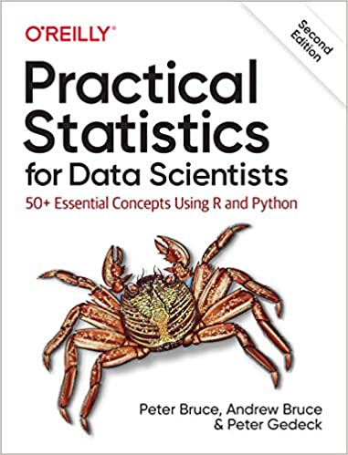

# Books
<table style="margin: 0px auto;">
<tr>
  <td></td>
  <td></td>
  <td></td>
  <td></td>
  <td></td>
  <td></td>
  <td></td>
</tr>
</table>

<table>
<tr>
  <td>
    
  </td>
  <td colspan=2>
    <h3>Practical Statistics for Data Scientists:</h3>
    <h4>50+ Essential Concepts Using R and Python</h4>
    
by Peter C. Bruce, Andrew Bruce, and 
      <a href="https://www.amazon.com/Peter-Gedeck/e/B082BJZJKX/">Peter Gedeck</a>

    <ul>
      <li>Publisher: <a href="https://oreil.ly/practicalStats_dataSci_2e">O'Reilly Media</a>; 2nd edition (June 9, 2020)</li>
      <li>ISBN-13: 978-1492072942</li>
      <li>Buy from 
        <a href="https://www.amazon.com/Practical-Statistics-Data-Scientists-Essential/dp/149207294X">Amazon</a>,
        <a href="https://www.barnesandnoble.com/w/practical-statistics-for-data-scientists-peter-bruce/1134424541">Barnes & Noble</a>
      </li>
      <li>Errata: <a href="http://oreilly.com/catalog/errata.csp?isbn=9781492072942">http://oreilly.com/catalog/errata.csp?isbn=9781492072942</a></li>
    </ul>

    
Code for Practial Statistics for Data Scientists is <a href="https://gedeck.github.io/practical-statistics-for-data-scientists/">here</a>.

    
<a href="https://gedeck.github.io/practical-statistics-for-data-scientists/">Translations</a> into several other languages are available.

  </td>
</tr>

<tr>
  <td colspan=2>
    <h3>Machine Learning for Business Analytics</h3>
    <h4>Concepts, Techniques and Applications in Python</h4>
    
by Galit Shmueli, Peter C. Bruce, 
      <a href="https://www.amazon.com/Peter-Gedeck/e/B082BJZJKX/">Peter Gedeck</a>,
      and Nitin R. Patel

    <ul>
    <li>Publisher: Wiley; 2nd edition (2025)</li>
    <!-- <li>ISBN-13: 978-1-119-54984-0</li>
    <li>Buy from 
      <a href="https://www.amazon.com/Data-Mining-Business-Analytics-Applications/dp/1119549841/">Amazon</a>,
      <a href="https://www.barnesandnoble.com/w/data-mining-for-business-analytics-galit-shmueli/1133021862">Barnes & Noble</a>
    </li>
    <li>Errata: <a href="https://www.dataminingbook.com/content/errata-python-edition">https://www.dataminingbook.com/content/errata-python-edition</a></li> -->
    </ul>
  </td>
  <td>
    
  </td>
</tr>

 <tr>
  <td>
    
  </td>
  <td colspan=2>
    <h3>Statistics for Data Science and Analytics</h3>
    
by Peter C. Bruce, <a href="https://www.amazon.com/Peter-Gedeck/e/B082BJZJKX/">Peter Gedeck</a>, Janet Dobbins

    <ul>
    <li>Publisher: Wiley; 1st edition (20242019)</li>
    <li>ISBN-13: TBD</li>
    <!--
    <li>Buy from 
      <a href="https://www.amazon.com/Data-Mining-Business-Analytics-Applications/dp/1119549841/">Amazon</a>,
      <a href="https://www.barnesandnoble.com/w/data-mining-for-business-analytics-galit-shmueli/1133021862">Barnes & Noble</a>
    </li>
    <li>Errata: <a href="https://www.dataminingbook.com/content/errata-python-edition">https://www.dataminingbook.com/content/errata-python-edition</a></li>
    -->
    </ul>
  </td>
</tr>

 <tr>
  <td colspan=2>
    <h3>Data Mining for Business Analytics:</h3>
    <h4>Concepts, Techniques and Applications in Python</h4>
    
by Galit Shmueli, Peter C. Bruce, <a href="https://www.amazon.com/Peter-Gedeck/e/B082BJZJKX/">Peter Gedeck</a>, Inbal Yahav, Nitin R. Patel

    <ul>
    <li>Publisher: <a href="https://www.wiley.com/en-us/Data+Mining+for+Business+Analytics%3A+Concepts%2C+Techniques+and+Applications+in+Python-p-9781119549840">Wiley</a>; 1st edition (November, 2019)</li>
    <li>ISBN-13: 978-1-119-54984-0</li>
    <li>ISBN-13: <a href="https://www.amazon.in/Mining-Business-Analytics-Indian-Adaptation/dp/9357461671/">978-9-357-46167-2</a> (Indian adaptation)</li>
    <li>Buy from 
      <a href="https://www.amazon.com/Data-Mining-Business-Analytics-Applications/dp/1119549841/">Amazon</a>,
      <a href="https://www.barnesandnoble.com/w/data-mining-for-business-analytics-galit-shmueli/1133021862">Barnes & Noble</a>
    </li>
    <li>Errata: <a href="https://www.dataminingbook.com/content/errata-python-edition">https://www.dataminingbook.com/content/errata-python-edition</a></li>
    </ul>
  </td>
  <td>
    
  </td>
</tr>

<tr>
  <td>
    
  </td>
  <td colspan=2>
    <h3>Machine Learning for Business Analytics</h3>
    <h4>Concepts, Techniques, and Applications in R</h4>

    
by Galit Shmueli, Peter C. Bruce, <a href="https://www.amazon.com/Peter-Gedeck/e/B082BJZJKX/">Peter Gedeck</a>, Inbal Yahav, Nitin R. Patel

    <ul>
      <li>Publisher: Wiley; 2nd edition (February, 2023)</li>
      <li>ISBN: 978-1-118-83517-2</li>
      <li>Buy from
        <a href="https://www.amazon.com/Machine-Learning-Business-Analytics-Applications/dp/1119835178/">Amazon</a>,
        <a href="https://www.wiley.com/en-us/Machine+Learning+for+Business+Analytics%3A+Concepts%2C+Techniques%2C+and+Applications+in+R%2C+2nd+Edition-p-9781119835172">Wiley</a>,
        <a href="https://www.barnesandnoble.com/w/machine-learning-for-business-analytics-galit-shmueli/1142606343">Barnes & Noble</a>
      </li>
    </ul>

    
Code for MLBA is <a href="https://gedeck.github.io/mlba-R-code/">here</a>.

  </td>
</tr>

<tr>
  <td colspan=2>
    <h3>Modern Statistics: A Computer Based Approach with Python</h3>

    
by Ron Kenett, Shelemyahu Zacks, <a href="https://www.amazon.com/Peter-Gedeck/e/B082BJZJKX/">Peter Gedeck</a>

    <ul>
    <li>Publisher: Springer International Publishing; 1st edition (September 15, 2022)</li>
    <li>ISBN-13: 978-3031075650</li>
    <li>Buy from
      <a href="https://www.amazon.com/Modern-Statistics-Computer-Based-Technology-Engineering/dp/303107565X/">Amazon</a>,
      <a href="https://link.springer.com/book/10.1007/978-3-031-07566-7">Springer</a>, 
      <a href="https://www.barnesandnoble.com/w/modern-statistics-ron-kenett/1141391736">Barnes & Noble</a>
      </li>
    </ul>
      
    
Code and solutions for Modern Statistics are <a href="https://gedeck.github.io/mistat-code-solutions/ModernStatistics/">here</a>.

  </td>
  <td>
    
  </td>
</tr>

<tr>
  <td>
    
  </td>
  <td colspan=2>
    <h3>Industrial Statistics: A Computer Based Approach with Python</h3>
    
by Ron Kenett, Shelemyahu Zacks, <a href="https://www.amazon.com/Peter-Gedeck/e/B082BJZJKX/">Peter Gedeck</a>

    <ul>
    <li>Publisher: <a href="https://link.springer.com/book/9783031284816">Springer International Publishing; 
      1st edition (August 5, 2023)</a></li>
    <li>ISBN-13: 978-3-031-28481-6 (hardcover), 978-3-031-28484-7 (softcover), 978-3-031-28482-3 (eBook)</li>
    <li>Buy from
      <a href="https://www.amazon.com/Industrial-Statistics-Computer-Based-Technology-Engineering/dp/303128481X/">Amazon</a>,
      <a href="https://link.springer.com/book/9783031284816">Springer</a>, 
      <a href="https://www.barnesandnoble.com/w/industrial-statistics-ron-kenett/1143037516">Barnes & Noble</a>
    </li>
    </ul>
    
Code and solutions for Industrial Statistics are <a href="https://gedeck.github.io/mistat-code-solutions/IndustrialStatistics/">here</a>.

  </td>
</tr>
</table>

